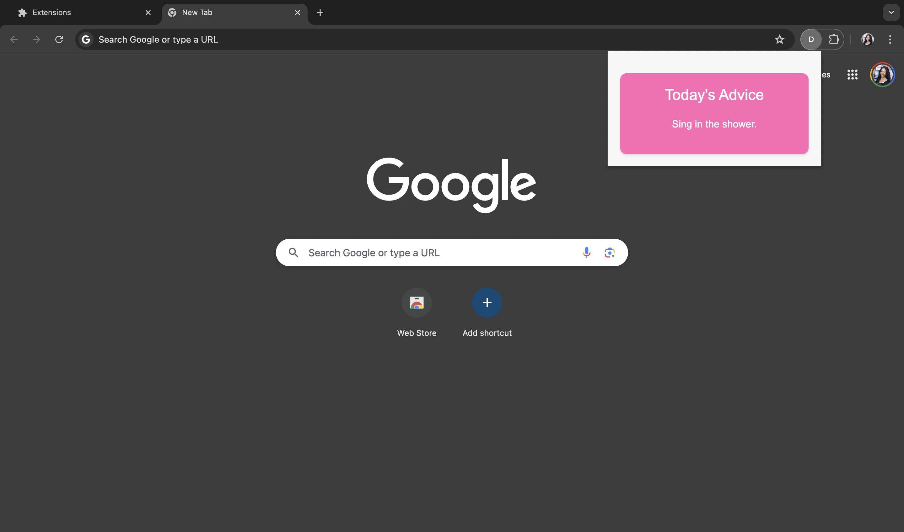

# Daily Advice Chrome Extension

Daily Advice is a Chrome extension that provides users with a daily piece of advice directly in their browser. This extension uses the AdviceSlip API to fetch a new piece of advice each day, promoting positivity and helpful insights in a kawaii-themed design.

## Features

- **Daily Advice:** Get a new piece of advice every day.
- **Cute Design:** Enjoy a kawaii-themed user interface.
- **Easy to Use:** Simple and intuitive UI with a responsive design.

## Installation

To install the Daily Advice Chrome Extension:

1. Clone or download this repository to your local machine.
2. Open Chrome and go to `chrome://extensions/`.
3. Enable **Developer mode** by toggling the switch in the upper-right corner.
4. Click on **Load unpacked** and select the directory where you downloaded/cloned the repository.

## Usage

Once the extension is installed:

1. Click on the Daily Advice icon in the Chrome toolbar.
2. A popup will appear with today's piece of advice.
3. The advice updates each time you open the popup.

